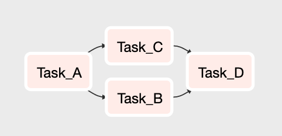
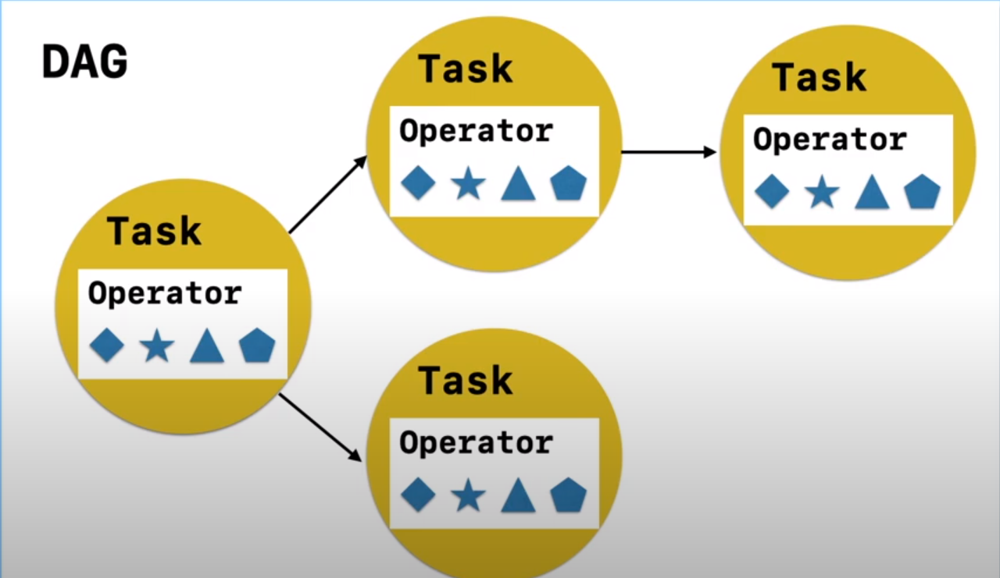
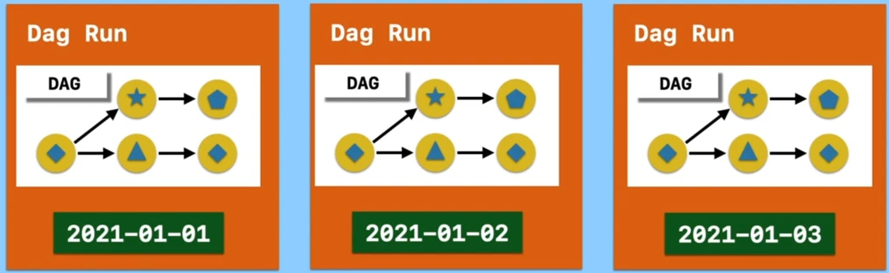

# Airflow Core Concepts

## What is Airflow?
- Apache Airflow is a popularly used tool to manage the automation of tasks and their workflows.
- Airflow represents the flow and dependencies of tasks in a data pipeline as a graph. Not only a graph, but one with some constraints.
- Written in Python

## What is a Workflow?
- A **Workflow** is a sequence of tasks
- In Airflow, workflows are represented as DAGs.

## What is a DAG?
Directed Acyclic Graph(DAG)

DAGs can be specifically defined as a series of tasks that you want to run as part of your workflow.

The graph is directed, meaning it starts with a task or multiple tasks and ends with a specific task or tasks. This is required to guarantee a path of execution. This way, the graph ensures that tasks do not run before all their dependent tasks are completed.

Graphs must also be acyclic, meaning that a task cannot point back to a previously completed task. In other words, it cannot cycle back. Without this constraint, a graph could run in an endless loop.

## What is a Task?
A Task is the basic unit of execution in Airflow. Tasks are arranged into DAGs, and then have upstream and downstream dependencies set between them into order to express the order they should run in.

Each node in a Airflow DAG is a task.

## What is a Operator?
An Operator is conceptually a template for a predefined Task, that you can just define declaratively inside your DAG.

Airflow has a very extensive set of operators available, with some built-in to the core or pre-installed providers. Some popular operators from core include:
- **BashOperator** - executes a bash command
- **PythonOperator** - calls an arbitrary Python function
- **EmailOperator** - sends an email
- and more!

## How do DAG, Task and Operator relate?
DAGs organize tasks, and Operators perform specific actions within those tasks. The dependencies between tasks define the execution order, creating a directed acyclic graph that orchestrates the workflow in Airflow.

## Execution Date, Task Instance, DAG-Run
Execution Date is the date and time which the DAG Run and its DAG instances are running for.

Example: There are 3 DAG-Runs in progress from *January 1st 2021* to *January 3rd 2021*

