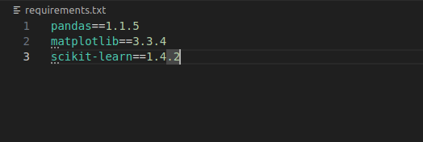
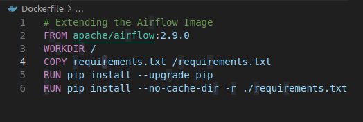
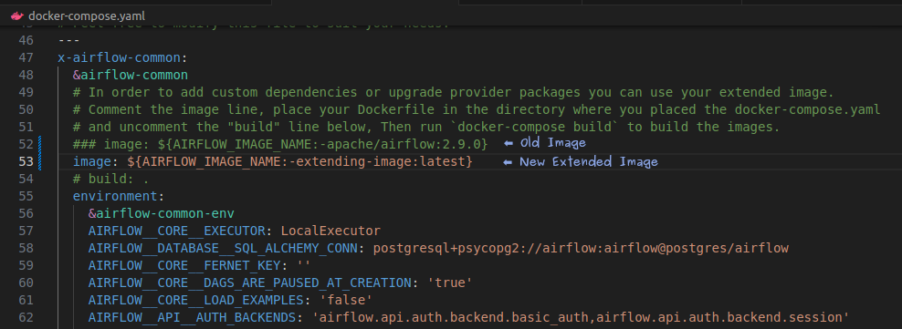

# Installing Python Dependencies To One's Airflow Docker Container

## In General, there are two ways,
- **Image Extending**
- **Image Customizing**

| <h3>Pros & Cons</h3> | <h3>Extending</h3> | <h3>Customizing</h3> |
|---|---|---|
| Can be built without airflow sources | YES | NO |
| Uses familiar  'FROM' pattern of image building | YES | NO |
| Requires only basic knowledge about images | YES | NO |
| Builds quickly | YES | NO |
| Produces image heavily optimized for size | NO | YES |
| Can build from custom airflow sources (forks) | NO | YES |
| Can build on air-gaped system | NO | YES |


## Image Extending

**1. We can use our own requirements.txt file to define extra dependencies.**
Example:



**2. We can use write a Dockerfile to create a extended version of the airflow image.**



**3. We can create docker image by running the following command:**

```Dockerfile
docker build . --file Dockerfile --tag extending-image:latest
```

**4. We can then use the new extended image in the docker-compose.yaml file instead of the airflow original image.**




## Image Customizing

**1. First we need to download the required git repository for airflow source code: [Airflow Repository Link](https://github.com/apache/airflow)**

**2. We can store the new requirements.txt file in `docker-context-files` directory, with the extra python dependencies and their supported versions.**

**3. Then we can build from Dockerfile and get the custom image.**

**4. We can then use the new custom image in the docker-compose.yaml file instead of the airflow original image.**

